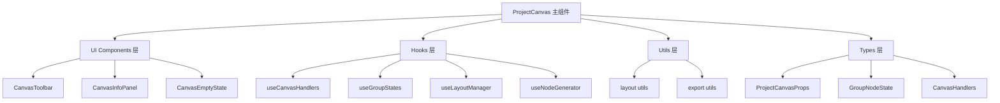

# ProjectCanvas画布重构文档

## 重构概述

本次重构将原本的单体组件 `ProjectCanvas.tsx`（约400行代码）拆分为模块化、可维护的组件架构。通过采用职责分离、Hook抽象、工具函数封装等方式，提升了代码的可读性、可维护性和可扩展性。

## 重构目标

- ✅ **模块化分离**：将单一大文件拆分为多个职责清晰的模块
- ✅ **提升可读性**：每个模块专注特定功能，降低认知负担
- ✅ **增强可维护性**：修改某个功能时只需关注相关模块
- ✅ **支持可扩展性**：新功能可以独立开发和集成
- ✅ **类型安全**：完整的TypeScript类型定义
- ✅ **复用性**：Hook和工具函数可在其他组件中复用

## 重构前后对比

### 重构前（单体架构）
```
ProjectCanvas.tsx (400+ lines)
├── 所有类型定义混在一起
├── 所有业务逻辑在一个组件中
├── UI组件和逻辑耦合
├── 工具函数内嵌在组件中
└── 难以测试和维护
```

### 重构后（模块化架构）
```
canvas/project/
├── types/                     # 类型定义
│   └── index.ts
├── utils/                     # 工具函数
│   ├── layout.ts              # 布局计算
│   └── export.ts              # 数据导入导出
├── hooks/                     # 自定义Hook
│   ├── useCanvasHandlers.ts   # 操作处理器
│   ├── useGroupStates.ts      # 组状态管理
│   ├── useLayoutManager.ts    # 布局管理
│   └── useNodeGenerator.ts    # 节点生成
├── components/                # UI组件
│   ├── CanvasToolbar.tsx      # 工具栏
│   ├── CanvasInfoPanel.tsx    # 信息面板
│   └── CanvasEmptyState.tsx   # 空状态
├── ProjectCanvas.tsx          # 主画布组件
└── index.ts                   # 模块导出
```

## 重构架构设计

### 1. 分层架构



### 2. 职责分离原则

| 层级 | 职责 | 示例 |
|------|------|------|
| **主组件层** | 组合各模块，处理数据流 | ProjectCanvas.tsx |
| **UI组件层** | 纯UI展示，接收props渲染 | CanvasToolbar, CanvasInfoPanel |
| **Hook层** | 业务逻辑封装，状态管理 | useGroupStates, useLayoutManager |
| **工具层** | 纯函数，无副作用的计算 | calculateLayout, exportLayoutData |
| **类型层** | TypeScript类型定义 | ProjectCanvasProps, GroupNodeState |

## 重构步骤详解

### 第一步：分析原始代码结构

```typescript
// 分析原始代码的职责
1. 类型定义 (interface, type)
2. 状态管理 (useState, useCallback)
3. 业务逻辑 (事件处理, 数据计算)
4. UI渲染 (JSX, 组件)
5. 工具函数 (布局计算, 导入导出)
```

### 第二步：创建目录结构

```bash
# 创建分层目录
mkdir -p canvas/project/{types,utils,hooks,components}

# 每个目录的作用：
# types/     - 存放TypeScript类型定义
# utils/     - 存放纯函数工具
# hooks/     - 存放自定义Hook
# components/ - 存放UI组件
```

### 第三步：提取类型定义

```typescript
// types/index.ts
// 将所有interface和type定义提取到独立文件
export interface ProjectCanvasProps { ... }
export interface GroupNodeState { ... }
export interface CanvasHandlers { ... }
```

**重构原则**：
- 按功能域分组类型
- 提供清晰的类型注释
- 使用泛型提升复用性

### 第四步：抽象工具函数

```typescript
// utils/layout.ts - 布局相关的纯函数
export function calculateGridLayout(groups, config) { ... }
export function calculateCircularLayout(groups, config) { ... }

// utils/export.ts - 数据导入导出
export function exportLayoutData(projectId, projectName, groupStates) { ... }
export function importLayoutData(onSuccess, onError) { ... }
```

**重构原则**：
- 纯函数，无副作用
- 单一职责，功能内聚
- 提供完整的错误处理

### 第五步：封装自定义Hook

```typescript
// hooks/useGroupStates.ts - 组状态管理
export function useGroupStates() {
  const [groupStates, setGroupStates] = useState({});
  const handleToggleExpand = useCallback(...);
  return { groupStates, handleToggleExpand, ... };
}

// hooks/useLayoutManager.ts - 布局管理
export function useLayoutManager(groups, groupStates, updateGroupStates) {
  const applyAutoLayout = useCallback(...);
  return { applyAutoLayout, ... };
}
```

**重构原则**：
- 每个Hook专注单一业务域
- 使用useCallback优化性能
- 提供清晰的返回接口

### 第六步：拆分UI组件

```typescript
// components/CanvasToolbar.tsx - 工具栏组件
export function CanvasToolbar({ onCreateGroup, onAutoLayout, ... }) {
  return (
    <Panel position="top-left">
      {/* 工具按钮 */}
    </Panel>
  );
}
```

**重构原则**：
- 组件只负责UI渲染
- 通过props接收数据和回调
- 保持组件的纯净性

### 第七步：重构主组件

```typescript
// ProjectCanvas.tsx - 主组件orchestration
export function ProjectCanvas(props) {
  // 使用各个Hook
  const handlers = useCanvasHandlers(props);
  const { groupStates, handleToggleExpand } = useGroupStates();
  const layoutManager = useLayoutManager(...);
  const nodes = useNodeGenerator(...);
  
  // 组合UI组件
  return (
    <ReactFlow>
      <CanvasToolbar {...toolbarProps} />
      <CanvasInfoPanel {...infoPanelProps} />
      {!hasGroups && <CanvasEmptyState {...emptyStateProps} />}
    </ReactFlow>
  );
}
```

**重构原则**：
- 主组件作为数据流的orchestrator
- 使用组合模式拼装功能
- 保持主组件逻辑简洁

### 第八步：创建统一导出

```typescript
// index.ts - 模块统一导出
export { ProjectCanvas } from './ProjectCanvas';
export type { ProjectCanvasProps, GroupNodeState } from './types';

// 按需导出子模块
export { CanvasToolbar } from './components/CanvasToolbar';
export { useLayoutManager } from './hooks/useLayoutManager';
export * from './utils/layout';
```

## 重构收益分析

### 代码质量提升

| 指标 | 重构前 | 重构后 | 提升 |
|------|--------|--------|------|
| **文件长度** | 400+ 行 | 主文件 < 150行 | ⬇️ 60% |
| **函数复杂度** | 高耦合 | 单一职责 | ⬆️ 显著提升 |
| **可测试性** | 困难 | 独立测试 | ⬆️ 大幅提升 |
| **可维护性** | 修改影响面大 | 局部修改 | ⬆️ 显著提升 |

### 开发体验改善

- **🔍 易于定位**：问题可快速定位到具体模块
- **🧪 易于测试**：每个模块可独立进行单元测试
- **🔄 易于复用**：Hook和工具函数可在其他组件中复用
- **👥 易于协作**：团队成员可并行开发不同模块
- **📝 易于文档**：每个模块职责清晰，易于编写文档

### 扩展能力增强

```typescript
// 新增布局类型只需要：
// 1. 在 utils/layout.ts 添加新的布局算法
export function calculateCustomLayout(groups, config) { ... }

// 2. 在 hooks/useLayoutManager.ts 添加新的Hook方法
const applyCustomLayout = useCallback(() => {
  applyAutoLayout('custom');
}, [applyAutoLayout]);

// 3. 在 components/CanvasToolbar.tsx 添加新按钮
<Button onClick={onCustomLayout}>自定义布局</Button>
```

## 应用到其他项目的通用思路

### 重构模式总结

1. **📊 分析阶段**
   - 识别组件职责边界
   - 找出可复用的逻辑
   - 分析数据流和状态依赖

2. **🏗️ 设计阶段**
   - 设计目录结构
   - 定义模块接口
   - 规划数据流向

3. **🔧 实施阶段**
   - 自底向上：先工具函数，再Hook，最后UI
   - 渐进式重构：逐步迁移功能
   - 保持功能完整性

4. **✅ 验证阶段**
   - 功能回归测试
   - 性能对比验证
   - 代码质量检查

### 重构检查清单

- [ ] **类型安全**：所有接口都有完整类型定义
- [ ] **单一职责**：每个模块职责清晰且单一
- [ ] **依赖管理**：模块间依赖关系清晰
- [ ] **性能优化**：合理使用useMemo/useCallback
- [ ] **错误处理**：完善的错误边界和异常处理
- [ ] **文档完善**：每个模块都有清晰的文档说明

### 适用场景

这套重构模式特别适用于：

1. **复杂业务组件**：逻辑复杂、功能多样的组件
2. **高复用需求**：需要在多个地方使用相似功能
3. **团队协作**：多人开发同一个大型组件
4. **长期维护**：需要长期迭代和维护的核心组件

## 总结

通过本次重构，我们成功将一个单体的大型组件转换为模块化、可维护的架构。这种重构方法不仅提升了代码质量，也为后续的功能扩展和团队协作奠定了良好基础。

重构的核心思想是**职责分离**和**组合模式**，通过将复杂问题分解为小的、可管理的模块，然后通过组合的方式构建完整功能。这种方法可以应用到任何复杂的前端组件重构中。
